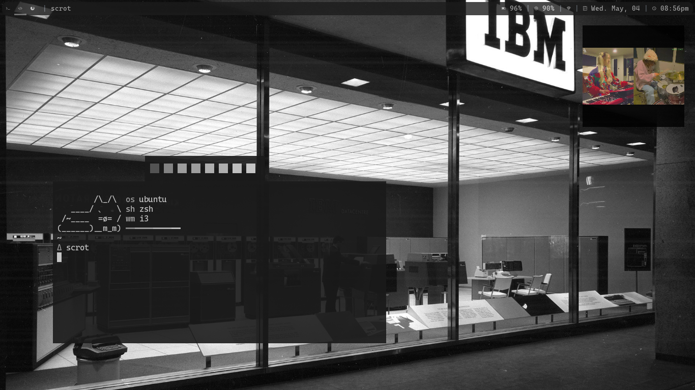

# i3-dotfiles
dotfiles for crouton

[find my scripts here](https://github.com/crue-ton/scripts)

## distro, and etc
i run ubuntu focal with i3wm + polybar:)

i use kitty terminal

for the most part i use pywal for colors

<h1 align=center>example</h1>

